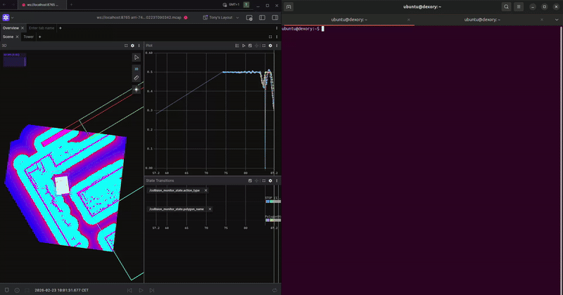

# foxglove_mcap_player



A ROS 2 node that plays back MCAP files (ROS 2 bags) with dual output:

1. **Foxglove WebSocket server** — full ranged playback controls (play/pause/seek/speed)
2. **ROS 2 topic republishing** — publishes each CDR-encoded message to its original topic

## Usage

```bash
ros2 run foxglove_mcap_player foxglove_mcap_player --ros-args \
  -p file:=/path/to/bag.mcap \
  -p port:=8765 \
  -p host:=127.0.0.1
```

### Parameters

| Parameter | Type   | Default     | Description                          |
|-----------|--------|-------------|--------------------------------------|
| `file`    | string | *(required)* | Path to the MCAP file to play back  |
| `port`    | int    | `8765`      | Foxglove WebSocket server port       |
| `host`    | string | `127.0.0.1` | Foxglove WebSocket server bind address |

## Dependencies

- **ROS 2** — `rclcpp`, `rosbag2_storage`
- **[Foxglove SDK](https://github.com/foxglove/foxglove-sdk)** v0.18.0 (fetched automatically via CMake)
- **[MCAP](https://github.com/foxglove/mcap)** v2.1.3 (header-only, fetched automatically via CMake)
- **lz4**, **zstd** — for MCAP decompression (system packages)

## Building

```bash
colcon build --packages-select foxglove_mcap_player
```

## How it works

The node reads the MCAP file summary to discover all channels and their schemas, then:

- Creates a **Foxglove `RawChannel`** for each MCAP channel to stream data to connected Foxglove clients
- Creates a **ROS 2 generic publisher** for each CDR-encoded channel, using the QoS profile recorded in the bag metadata when available
- Plays back messages in log-time order, respecting the configured playback speed
- Broadcasts the current playback time to Foxglove clients at ~60 Hz

Playback is controlled via the Foxglove WebSocket protocol (play, pause, seek, speed).
